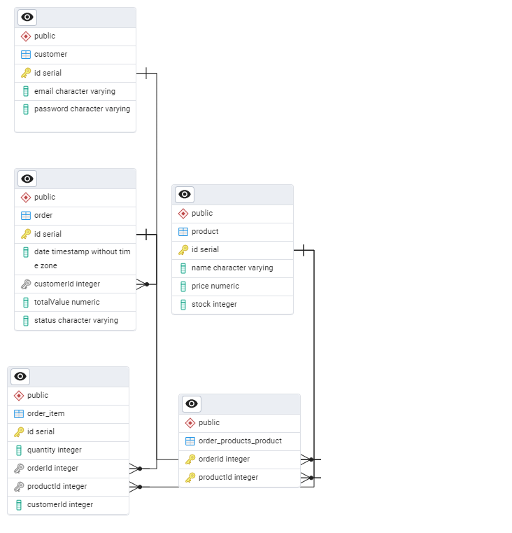

# System Zarządzania Zamówieniami

## 1. Faza projektowania

### A. Wymagania funkcjonalne

System umożliwia:

- Przechowywanie informacji o klientach: imię, nazwisko, e-mail
- Przechowywanie informacji o produktach: nazwa, cena, stan magazynowy
- Rejestrowanie zamówień: data, łączna wartość, lista produktów
- Powiązanie klienta z jego zamówieniami oraz powiązanie zamówień z produktami

### B. Wymagania niefunkcjonalne

- Spójność i poprawność danych (np. brak możliwości zamówienia produktu niedostępnego w magazynie)
- Obsługa wielu użytkowników i wielu zamówień jednocześnie

### C. Diagram ERD



### D. Encje i typy pól

**Tabela `customer`**

- `id`: integer, primary key
- `first_name`: varchar
- `last_name`: varchar
- `email`: varchar, unique

**Tabela `product`**

- `id`: integer, primary key
- `name`: varchar
- `price`: decimal
- `stock`: integer

**Tabela `order`**

- `id`: integer, primary key
- `date`: timestamp
- `totalValue`: decimal
- `status`: varchar
- `customerId`: foreign key → customer.id

**Tabela `order_items`**

- `id`: integer, primary key
- `orderId`: foreign key → order.id
- `productId`: foreign key → product.id
- `quantity`: integer

### E. Związki między encjami

- Jeden klient może mieć wiele zamówień (1:N)
- Jedno zamówienie może zawierać wiele produktów (N:M, przez `order_items`)
- Jeden produkt może znajdować się w wielu zamówieniach (N:M)

### F. Normalizacja

- **1NF**: brak powtarzających się kolumn, wszystkie wartości są atomowe
- **2NF**: atrybuty zależne od całego klucza głównego
- **3NF**: brak zależności przechodnich

---

## 2. Faza implementacji

### A. Tworzenie bazy danych

- Baza danych utworzona w PostgreSQL
- Typy danych zgodne z modelem logicznym
- Zdefiniowane klucze główne i obce
- Ograniczenia:
  - `NOT NULL`
  - `UNIQUE` (dla `email`)
  - `CHECK` (`price >= 0`, `stock >= 0`)

### B. Przykładowe dane

Dodano:

- 5 klientów
- 5 produktów
- 5 zamówień z różnymi produktami i wartościami

---

## 3. Operacje i zapytania SQL (CRUD)

### 1. Lista klientów i liczba ich zamówień

```sql
SELECT c.first_name, c.last_name, COUNT(o.id) AS orders_count
FROM customer c
LEFT JOIN "order" o ON o."customerId" = c.id
GROUP BY c.id;
```
